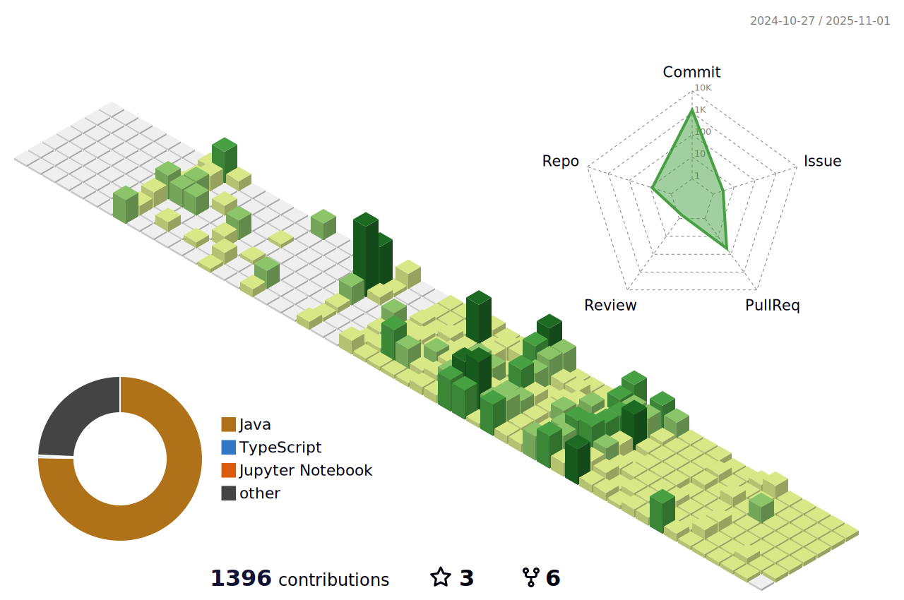

### Profile Views
counting of visitors to this page in this section started from April 9, 2025

## 👋 Hi, I'm Niranjan!  

🔥 *Make it work, make it right, make it fast – then push to GitHub.*  
🚀 Passionate about **Java, Spring Boot, and DevOps** | **Android Developer** | **Competitive Programmer**  

## 🏆 Achievements  
- **Top 20%** in LeetCode Contests  
- **Runner** in TechHack for Developing Application – 2024  
- **3rd Place** in Code-a-thon at CSI State Convention  

## 🌱 Currently Learning  
- **DevOps** with Java Spring Boot: CI/CD, Docker, Kubernetes  
- Advanced **Spring Boot** for scalable applications  
- **Android Development** with Spring Boot backend  

## 🔥 Experience  
- **Technical Website Lead** – CSI, Anurag University  
- **Hackathon Participant** – DevOps Domain  
- **Attended Microsoft AI Tour – Bengaluru 2025**  

## 📫 Connect with Me  
    

## 🌐 Socials  
    

## 🛠️ Tech Stack  
- **Languages**: Java, C  
- **Frameworks**: Spring Boot, Thymeleaf  
- **DevOps**: Docker, Kubernetes, CI/CD  
- **Tools**: Git, Linux (Kali), Postman  
- **Competitive Programming**: LeetCode, CodeChef  

## 📜 Random Inspiring Quote  

  

## 🎵 Now Playing  
*A developer without music is like code without syntax—lifeless. Let the rhythm fuel your creativity and the melody guide your logic.*  

  
 
  

## 🏅 GitHub Trophies  
  

## 📊 GitHub Stats & Contributions   

  
  
   
 

</img>  

## 🚀 Let's Build Something Amazing!  
📧 **Email:** [niranjan.margam.14@gmail.com](mailto:niranjan.margam.14@gmail.com)  

## 💰 Support By Donating  

